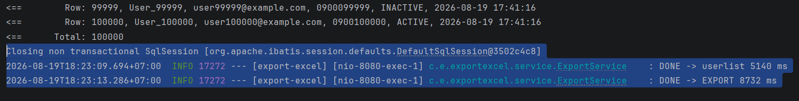
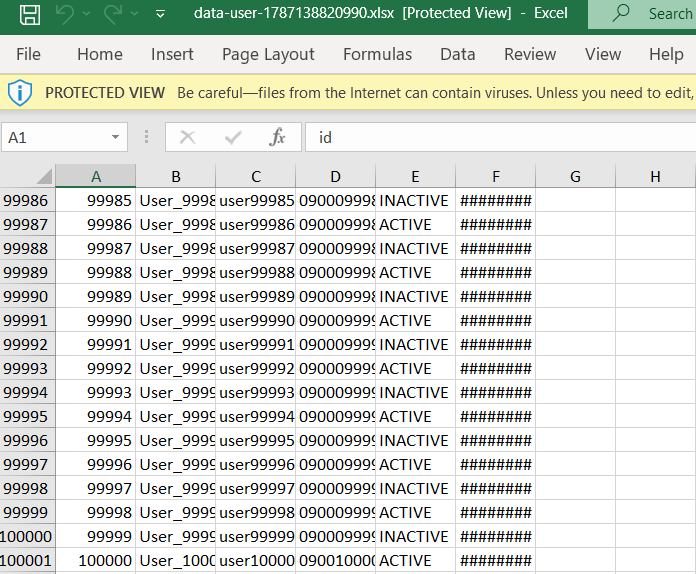

# MyBatis + EasyExcel — 1M Records Excel Export

A Spring Boot application demonstrating how to export **1,000,000 database records** to an Excel file using **MyBatis** and **Alibaba EasyExcel**.

The project focuses on efficient database querying and Excel generation while keeping memory usage under control.

---

## Overview

This project demonstrates an Excel export workflow for a large dataset:

```text
MySQL
  │
  │ MyBatis
  ▼
Database Records
  │
  │ Streaming / Batch Processing
  ▼
Export Service
  │
  │ EasyExcel
  ▼
Excel File (.xlsx)
```

The main goal is to export a large amount of data without loading the entire dataset into memory at once.

### Benchmark

The test dataset contains:

```text
1,000,000 records
```

Example benchmark result:

```text
DONE -> userlist 5140 ms
DONE -> EXPORT 8732 ms
```

Total export time:

```text
~8.7 seconds
```

> Benchmark results depend on hardware, database configuration, JVM configuration, disk speed, and dataset structure.

---

# Tech Stack

| Technology  | Purpose                       |
| ----------- | ----------------------------- |
| Java        | Programming language          |
| Spring Boot | Application framework         |
| MyBatis     | Database access               |
| EasyExcel   | Excel generation              |
| MySQL       | Database                      |
| Maven       | Build & dependency management |

---

# Project Structure

```text
src/
├── main/
│   ├── java/
│   │   └── com/example/exportexcel/
│   │       ├── controller/
│   │       ├── service/
│   │       ├── mapper/
│   │       ├── entity/
│   │       └── ExportExcelApplication.java
│   │
│   └── resources/
│       ├── mapper/
│       └── application.yml
│
└── test/
```

---

# Requirements

Make sure the following are installed:

* Java 17+
* Maven 3.8+
* MySQL 8+
* Git

Check your environment:

```bash
java -version
mvn -version
mysql --version
```

---

# Installation

## 1. Clone the repository

```bash
git clone <YOUR_REPOSITORY_URL>
cd export-excel
```

## 2. Configure Database

Update the database configuration in:

```text
src/main/resources/application.yml
```

Example:

```yaml
spring:
  datasource:
    url: jdbc:mysql://localhost:3306/export_excel
    username: root
    password: your_password
```

Create the database:

```sql
CREATE DATABASE export_excel;
```

Then import/create the required tables.

---

# Run the Application

Build the project:

```bash
mvn clean package
```

Run the application:

```bash
mvn spring-boot:run
```

The application will start on:

```text
http://localhost:8080
```

---

# Export 1,000,000 Records

The export endpoint is responsible for generating the Excel file from the database.

Example:

```http
GET /api/export/users
```

The application will:

1. Query records from MySQL using MyBatis.
2. Process the records.
3. Write the records using EasyExcel.
4. Generate an `.xlsx` file.
5. Return the generated file to the client.

---

# Performance Benchmark

The test was performed with:

```text
Dataset:       1,000,000 records
Database:      MySQL
ORM / Mapper:  MyBatis
Excel Library: EasyExcel
```

Example application log:

```text
Closing non transactional SqlSession
[org.apache.ibatis.session.defaults.DefaultSqlSession@3502c4c8]

DONE -> userlist 5140 ms

DONE -> EXPORT 8732 ms
```

### Result

| Operation                 |      Time |
| ------------------------- | --------: |
| Query / process user list |    ~5.1 s |
| Complete export           |    ~8.7 s |
| Records                   | 1,000,000 |

The complete export finished in approximately:

```text
8.7 seconds
```

---

# Screenshot Evidence

The following screenshots are included as evidence of the benchmark and export result.

## 1. Database — 1,000,000 Records

Show the database containing approximately **1 million records**.

> 📸 **Screenshot:** Take a screenshot showing the database/table and record count.

```text
[ INSERT SCREENSHOT HERE ]
```

---

## 2. Application Startup

Show the Spring Boot application successfully starting.

> 📸 **Screenshot:** Take a screenshot of the application startup log.

```text
[ INSERT SCREENSHOT HERE ]
```

---

## 3. Export Request

Show the request being executed successfully.

> 📸 **Screenshot:** Take a screenshot of Postman / browser / API client showing the export request.

```text
[ INSERT SCREENSHOT HERE ]
```

---

## 4. Performance Log

Show the actual export performance from the application logs.

> 📸 **Screenshot:** Take a screenshot containing:

```text
DONE -> userlist 5140 ms
DONE -> EXPORT 8732 ms
```

```text
[ INSERT SCREENSHOT HERE ]
```

---

## 5. Generated Excel File

Show the generated `.xlsx` file after the export has completed.

> 📸 **Screenshot:** Take a screenshot showing the generated Excel file and its file size.

```text
[ INSERT SCREENSHOT HERE ]
```

---

## 6. Excel Result

Open the generated Excel file and verify that the exported data is present.

> 📸 **Screenshot:** Take a screenshot of the generated Excel file showing the exported records.

```text


```

---

# Why MyBatis + EasyExcel?

## MyBatis

MyBatis provides direct control over SQL queries and database access.

This is useful for large-data operations where query performance and SQL optimization are important.

Advantages:

* Full control over SQL
* Easy to optimize queries
* Lightweight persistence layer
* Suitable for large read operations

---

## EasyExcel

EasyExcel is designed for reading and writing large Excel files efficiently.

Instead of constructing the entire Excel workbook in memory, the library supports efficient writing of large datasets.

This makes it suitable for exporting large amounts of data.

---

# Large Dataset Considerations

Exporting 1 million records is different from exporting a few thousand records.

Important considerations include:

### Database

The SQL query should be optimized.

Avoid unnecessary:

```sql
SELECT *
```

Prefer selecting only the required columns:

```sql
SELECT
    id,
    name,
    email,
    created_at
FROM users;
```

Indexes should also be considered for filtering and sorting operations.

---

### Memory

Avoid unnecessarily storing all records in Java collections:

```java
List<User> users = userMapper.findAll();
```

For very large datasets, loading the entire result into memory can cause excessive heap usage.

A better approach is to process data progressively using an appropriate MyBatis retrieval strategy.

---

### Excel Generation

EasyExcel should write records progressively rather than constructing a huge in-memory object graph.

Conceptually:

```text
Database
   │
   ▼
Read records
   │
   ▼
Process batch
   │
   ▼
Write to Excel
   │
   ▼
Release batch
   │
   ▼
Next batch
```

---

# Performance Notes

The benchmark in this project is intended as a **practical local benchmark**, not a universal performance claim.

Actual performance can vary depending on:

* CPU
* RAM
* JVM heap size
* MySQL configuration
* Database location
* SSD/HDD performance
* Network latency
* SQL query complexity
* Number of exported columns
* Excel file size

Therefore, the reported `~8.7 seconds` should be interpreted as the result of this project's test environment.

---

# Future Improvements

Potential improvements for future versions:

* [ ] Streaming database results
* [ ] Batch-based export
* [ ] Export progress tracking
* [ ] Asynchronous export
* [ ] Export job management
* [ ] Redis-based export status
* [ ] Large-file download optimization
* [ ] Export multiple sheets
* [ ] Performance comparison between different MyBatis strategies

---

# License

This project is created for learning and performance experimentation with large-scale Excel export using Java, MyBatis, and EasyExcel.
